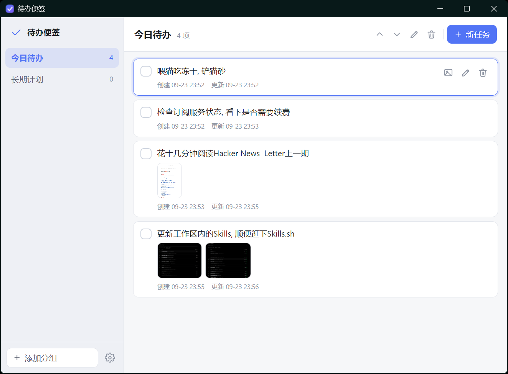
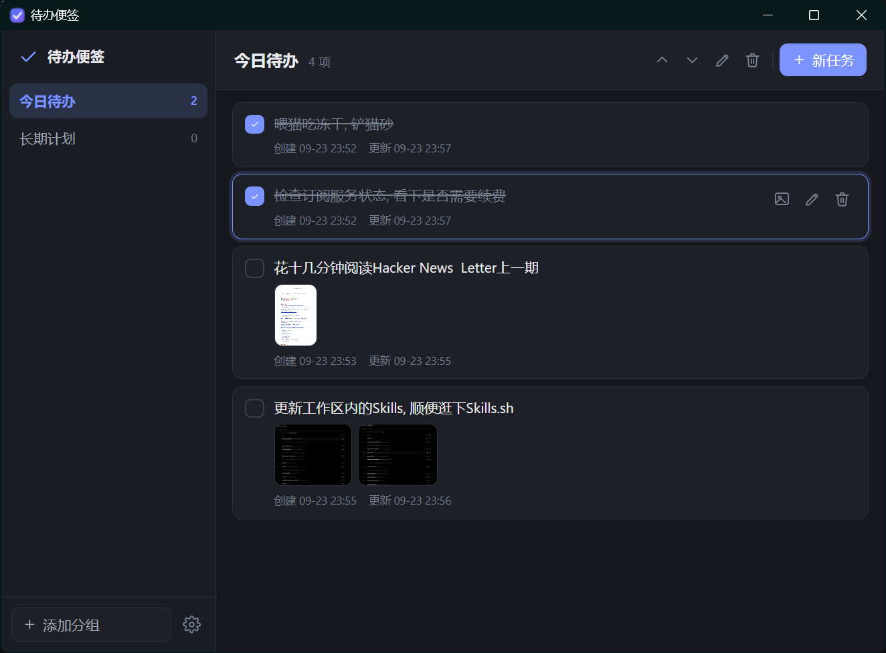

# sticky-todo

一款自用的轻量级桌面便签／待办清单。数据完全放在本地，格式是纯 JSON，备份与同步就是复制一个目录。

## 功能

- 桌面端可执行程序，使用系统 WebView2，不打包浏览器内核，产物体积以 MB 计
- 窗口置顶可随时开关
- 数据目录可自定义，默认位于系统应用数据目录
- 分组支持增删改与上下移动；任务支持上下移动
- 待办支持勾选完成状态，行内显示创建时间与更新时间
- 图片支持拖放、剪贴板粘贴、文件选择三种入口
- 两种布局：面板（左分组右任务）与列表（单列、分组可折叠）
- 显示开关：隐藏已完成、已完成置底、隐藏操作按钮、显示创建时间、显示更新时间
- 三套主题：明亮、暗黑、跟随系统
- 快捷键：应用内一整套，外加一个全局唤起键
- 托盘常驻，关闭按钮默认隐藏到托盘，可改为直接退出
- 开机自启开关

## 界面

同一份数据、同一套布局，明亮与暗黑两套主题：

| 明亮 | 暗黑 |
| --- | --- |
|  |  |

任务行里直接显示创建时间与更新时间；带图片的待办会在文字下方显示缩略图。

## 数据存储

数据目录下有两个内容：

```
data.json      分组、任务与设置
attachments/   导入的图片，按内容哈希命名
```

图片按 SHA-256 内容哈希命名，同一张图重复导入只占一份文件。

应用级配置位于系统应用配置目录下的 `config.json`，只记录 `dataDir` 一个字段。它描述的是「数据在哪」，因此不参与同步。

删除任务不会自动清理不再被引用的图片，避免误删被其它任务共享的文件。

### 备份与同步

复制整个数据目录即可。若把数据目录放在 OneDrive、坚果云等同步盘里，注意不要在两台机器上同时编辑同一份文件。

## 快捷键

### 应用内（窗口聚焦时生效）

| 按键 | 功能 |
| --- | --- |
| `↑` | 上一个任务 |
| `↓` | 下一个任务 |
| `←` | 上一个分组 |
| `→` | 下一个分组 |
| `Ctrl + N` | 新建任务并进入编辑 |
| `Space` | 切换当前任务的完成状态 |
| `Enter` | 进入编辑 / 确认编辑 |
| `Delete`、`Backspace` | 删除当前任务 |
| `Esc` | 取消编辑 / 关闭设置面板 / 关闭图片预览 |

编辑状态下方向键与 `Space` 不生效，只有 `Enter` 保存、`Shift + Enter` 换行、`Esc` 取消。

### 全局

`Ctrl + Alt + N`：在任意界面按下都会显示窗口并新建一条待办。可在设置里关闭或改键；如果该组合键已被其它程序占用，设置面板会给出提示。

## 开发

```bash
# 前端单元测试（Node 内置测试运行器，无第三方依赖）
npm test

# Rust 单元测试
cd src-tauri
cargo test

# 开发模式
npm install
npm run dev
```

## 构建

```bash
cd src-tauri
cargo build --release
```

`Cargo.toml` 里把 `custom-protocol` 设成了默认 feature，这一步不能省：Tauri 用它区分「加载嵌入二进制的前端资源」和「连接 devUrl 的开发服务器」。漏掉它构建出的 exe 会一直去连 `http://localhost:1420`，界面是空白的。

产物为 `src-tauri/target/release/sticky-todo.exe`，本机实测 3,534,336 字节（约 3.37 MB）。

### 关于体积

- release 产物 3.37 MB，运行只依赖系统自带的 WebView2 运行时，不需要额外安装。
- 未开启 `bundle`，只产出单个 exe；需要安装包时可另行配置 Tauri 的 NSIS 目标。
- WebView2 运行时由 Windows 11 内置提供，不随产物分发。
- `src-tauri/Cargo.toml` 的 release 配置为 `opt-level = "s"`、`lto = true`、`strip = true`、`panic = "abort"`、`codegen-units = 1`。

## 目录结构

```
src/                     前端，无框架、无构建步骤，直接由 Tauri 加载
  index.html
  style.css              三套主题的 CSS 变量与全部样式
  model.js               纯数据投影：过滤、排序、计数、时间格式化
  store.js               唯一的状态持有者与持久化
  render.js              把投影结果渲染成 DOM
  events.js              事件委托与快捷键
  theme.js               主题解析
  icons.js               内联 SVG
  app.js                 入口装配
  *.test.js              前端单元测试

src-tauri/
  src/lib.rs             命令、插件、托盘、窗口事件
  src/store.rs           data.json 的原子读写
  src/config.rs          本机数据目录配置
  src/images.rs          图片导入
  capabilities/          前端权限集

docs/superpowers/specs/  设计文档
```

## 设计文档

实现依据见 [`docs/superpowers/specs/2026-09-23-sticky-todo-design.md`](docs/superpowers/specs/2026-09-23-sticky-todo-design.md)。
