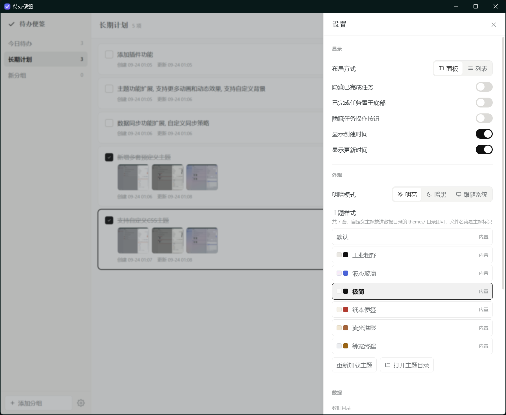
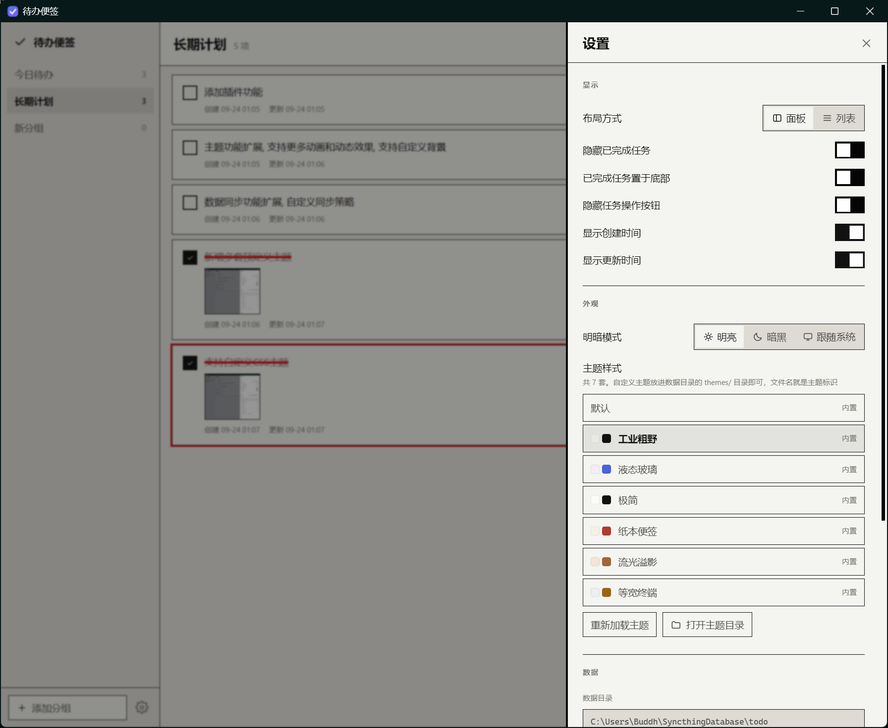
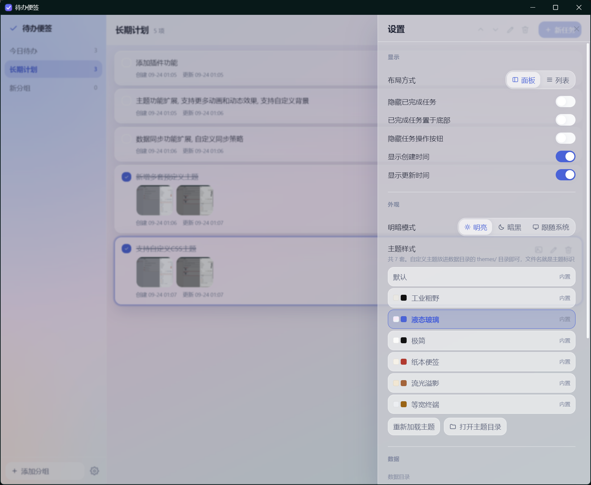
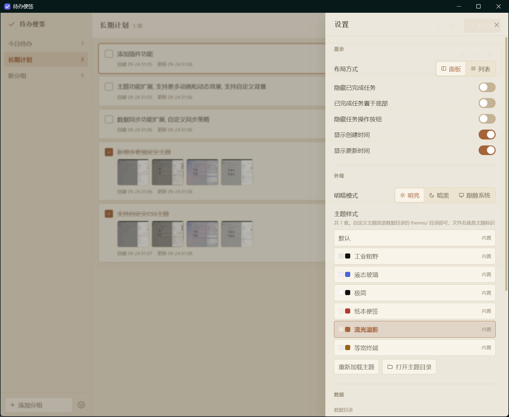

# sticky-todo

一款自用的轻量级桌面便签／待办清单。数据完全放在本地，格式是纯 JSON，备份与同步就是复制一个目录。

## 功能

- 桌面端可执行程序，使用系统 WebView2，不打包浏览器内核，产物体积以 MB 计
- 窗口置顶可随时开关
- 数据目录可自定义，默认位于系统应用数据目录
- 分组支持增删改与上下移动；任务支持上下移动
- 全文搜索：匹配任务正文，跨分组实时过滤，命中的片段高亮
- 左栏视图：全部待办 / 今天 / 逾期 / 本周，与分组并列，各带未完成计数
- 任务可以设置到期时间（精确到分钟），逾期的高亮显示
- 到点提醒：程序在运行（含隐藏到托盘）时发系统通知
- 重复任务：每天 / 工作日 / 每周 / 每月 / 每 N 天·周·月，完成时自动排下一条
- 检查更新与自动更新：启动后自动查一次（之后每 6 小时一次），发现新版本自动下载，点一下替换并重启
- 待办支持勾选完成状态，行内显示创建时间与更新时间
- 图片支持拖放、剪贴板粘贴、文件选择三种入口
- 两种布局：面板（左分组右任务）与列表（单列、分组可折叠）
- 显示开关：隐藏已完成、已完成置底、隐藏操作按钮、显示创建时间、显示更新时间
- 十套内置主题：默认、极简、纸本便签、流光溢影、液态玻璃、工业粗野、等宽终端、方块世界、石木村庄、下界岩浆，每套自带明暗两套配色
- 明暗模式：明亮、暗黑、跟随系统
- 主题可自定义：内置主题会在启动时补齐到数据目录的 `themes/` 目录，改那份文件即可，界面里能重新加载，不必重启，也不必重新构建程序
- 快捷键：应用内一整套，外加一个全局唤起键
- 托盘常驻，关闭按钮默认隐藏到托盘，可改为直接退出
- 开机自启开关

## 界面

内置十套主题，每套都自带明暗两套配色，在设置里随时切换。下面是其中四套（明亮模式）：

| 极简 | 工业粗野 |
| --- | --- |
|  |  |

| 液态玻璃 | 流光溢影 |
| --- | --- |
|  |  |

任务行里直接显示创建时间与更新时间；带图片的待办会在文字下方显示缩略图。

截图取自 1.1.0。1.2.0 起左侧栏多了搜索框与「全部待办」视图；主题与布局本身没有变化。1.2.0 里短暂出现过的标签功能已在 1.3.0 移除，组织任务仍然只有分组这一条轴。

「方块世界」「石木村庄」「下界岩浆」这三套共用同一套像素语言：圆角全部归零，任务行用两色内阴影做出按钮浮雕，背景压一层像素纹理，文字用内置的点阵字体「方舟像素 12px」（简体中文分片，自带拉丁字形）。点阵字体只在整数倍字号下锐利，所以这三套把字号限制在 12px 与 24px 两档。字体文件与许可见 [`src/fonts/`](src/fonts/)：方舟像素由 TakWolf 以 SIL Open Font License 1.1 发布，允许随程序分发，版权声明与许可全文随字体一起放在仓库里。

主题是数据而不是代码：程序启动时会把十套内置主题补齐到数据目录的 `themes/` 目录（只补缺的，已经存在的一律不覆盖），你也可以照同样的格式放自己的 CSS，界面里点「重新加载主题」就能用上，不需要改程序，也不需要重新构建。

`themes/` 里同名的文件优先于程序内置的那份，所以想调主题就直接改数据目录里的副本，改坏了删掉即可 —— 下次启动会补一份内置的回来。代价是程序内置的那份从此被遮蔽，改 `src/themes/` 不再影响界面。`default`（默认）是例外：它没有对应的文件，取值来自 `style.css` 里的默认值。

## 数据存储

数据目录下有两个内容：

```
data.json      分组、任务与设置
attachments/   导入的图片，按内容哈希命名
```

图片按 SHA-256 内容哈希命名，同一张图重复导入只占一份文件。

`data.json` 的当前版本是 3。版本 3 给任务加了 `dueAt`（到期时间）与 `repeat`（重复规则）；版本 1 与版本 2 的文件会被自动升级到 3。反过来，1.4.1 及更早的程序看到版本 3 会拒绝打开——数据在多台机器间同步时，各台都要升到 1.5.0。若文件里还留着标签时代的 `tags` 内容，程序会拒绝写入并说明原因，不会静默抹掉。

## 到期与提醒

点任务行上的日历按钮，选日期与时刻（默认早上 9 点），需要的话再加一条重复规则。改完立刻保存。

- 左栏有「今天」「逾期」「本周」三个视图，各带未完成计数；逾期任务的到期徽章会变红。
- 提醒由常驻线程每 30 秒检查一次，同一个到期时刻只响一次。窗口隐藏到托盘时照样提醒；从设置里「退出」之后就不提醒了。
- 程序启动时只补提醒 24 小时内到期的任务，不会一开机就炸出一堆历史逾期。
- 重复任务是「完成后排下一次」：勾选完成时按规则算出下一次并新建一条未完成任务，原任务留在已完成里做记录；取消勾选不会回收已经排出来的那一条。
- 通知没有代码签名，Windows 可能把它显示成来源未知的应用。

应用级配置位于系统应用配置目录下的 `config.json`，只记录 `dataDir` 一个字段。它描述的是「数据在哪」，因此不参与同步。

删除任务不会自动清理不再被引用的图片，避免误删被其它任务共享的文件。

### 备份与同步

复制整个数据目录即可。若把数据目录放在 OneDrive、坚果云等同步盘里，注意不要在两台机器上同时编辑同一份文件。

多机使用时留意 `data.json` 的版本号：升级到 1.5.0 之后文件会变成版本 3，只有 1.5.0 及更新的程序能打开，几台机器要一起升。

## 更新

程序会在启动 8 秒后查一次 GitHub Releases，之后每 6 小时一次。发现新版本就自动下载到数据目录的 `updates/` 下，下载完在设置面板的「更新」里点「更新并重启」完成替换。

- 自动检查可以在设置里关掉；关掉之后仍可随时手动点「检查更新」，托盘右键菜单里也有同一项。
- 下载完会用 Release 资产自带的 SHA-256 摘要校验，对不上就丢弃。源头没给摘要时界面会标注「未校验」。
- 更新源默认指向本仓库的 Releases，可以用环境变量 `STICKY_TODO_UPDATE_ENDPOINT` 换成镜像或自建地址。
- 替换由一段批处理脚本在进程退出后完成：它反复尝试覆盖，成功就启动新版本；覆盖不了（例如程序放在 `C:\Program Files` 这类需要提权的目录）会记下结果，下次启动时提示你手动替换，新文件留在 `%TEMP%` 里。
- 产物没有代码签名，所以 SHA-256 只能证明「文件没坏」，不能证明「文件没被换过」。

## 快捷键

### 应用内（窗口聚焦时生效）

| 按键 | 功能 |
| --- | --- |
| `↑` | 上一个任务 |
| `↓` | 下一个任务 |
| `←` | 上一个分组 |
| `→` | 下一个分组 |
| `Ctrl + N` | 新建任务并进入编辑 |
| `Ctrl + F` | 聚焦搜索框（重新按一次会全选已输入的内容） |
| `Space` | 切换当前任务的完成状态 |
| `Enter` | 进入编辑 / 确认编辑 |
| `Delete`、`Backspace` | 删除当前任务 |
| `Esc` | 取消编辑 / 关闭设置面板 / 关闭图片预览 |

编辑状态下方向键与 `Space` 不生效，只有 `Enter` 保存、`Shift + Enter` 换行、`Esc` 取消。

搜索框里回车不提交任何东西，`Esc` 清空搜索词并把焦点交还列表。

### 全局

`Ctrl + Alt + N`：在任意界面按下都会显示窗口并新建一条待办。可在设置里关闭或改键；如果该组合键已被其它程序占用，设置面板会给出提示。

## 开发

```bash
# 前端单元测试（Node 内置测试运行器，无第三方依赖）
npm test

# Rust 单元测试
cd src-tauri
cargo test

# 开发模式
npm install
npm run dev
```

## 构建

```bash
cd src-tauri
cargo build --release
```

`Cargo.toml` 里把 `custom-protocol` 设成了默认 feature，这一步不能省：Tauri 用它区分「加载嵌入二进制的前端资源」和「连接 devUrl 的开发服务器」。漏掉它构建出的 exe 会一直去连 `http://localhost:1420`，界面是空白的。

产物为 `src-tauri/target/release/sticky-todo.exe`，本机实测 4,296,704 字节（约 4.10 MB）。

### 关于体积

- release 产物 4.10 MB，运行只依赖系统自带的 WebView2 运行时，不需要额外安装。
- 其中约 165 KB 是检查更新用的 HTTP 客户端（`ureq`，只启用系统 TLS，不打包 rustls——打包那套会让产物多出 1 MB）。
- 其中 539 KB 是内置的点阵字体（方舟像素 12px 简体中文分片），只在「方块世界」那三套主题里被引用，其它主题不会加载它。
- 未开启 `bundle`，只产出单个 exe；需要安装包时可另行配置 Tauri 的 NSIS 目标。
- WebView2 运行时由 Windows 11 内置提供，不随产物分发。
- `src-tauri/Cargo.toml` 的 release 配置为 `opt-level = "s"`、`lto = true`、`strip = true`、`panic = "abort"`、`codegen-units = 1`。

## 目录结构

```
src/                     前端，无框架、无构建步骤，直接由 Tauri 加载
  index.html
  style.css              变量契约与全部结构样式（颜色值都在变量里，主题负责覆盖）
  model.js               纯数据投影：视图、过滤、排序、计数、高亮、时间格式化
  store.js               唯一的状态持有者与持久化
  render.js              把投影结果渲染成 DOM
  events.js              事件委托与快捷键
  theme.js               主题清单、加载、变量块提取、应用
  icons.js               内联 SVG
  app.js                 入口装配
  *.test.js              前端单元测试
  themes/                内置主题，一个 CSS 文件就是一套；也是写自定义主题的参考

src-tauri/
  src/lib.rs             命令、插件、托盘、窗口事件
  src/store.rs           data.json 的原子读写
  src/config.rs          本机数据目录配置
  src/images.rs          图片导入
  src/themes.rs          自定义主题文件的读取
  capabilities/          前端权限集

docs/superpowers/specs/  设计文档
docs/superpowers/plans/  实现计划
```

## 设计文档

实现依据见 [`docs/superpowers/specs/2026-09-23-sticky-todo-design.md`](docs/superpowers/specs/2026-09-23-sticky-todo-design.md)。

搜索与「全部待办」视图的设计见 [`docs/superpowers/specs/2026-09-26-tags-search-views-design.md`](docs/superpowers/specs/2026-09-26-tags-search-views-design.md)：该设计同时包含了标签功能，而标签已在 1.3.0 移除，文档保留了完整的决策过程与移除记录。实现计划见 [`docs/superpowers/plans/2026-09-26-tags-search-views-plan.md`](docs/superpowers/plans/2026-09-26-tags-search-views-plan.md)。
